# Casa Amanzi Spa - Image Specifications for Designers

This package contains all current website images and their specifications. Please maintain the same file names and folder structure when providing updated artwork.

---

## Brand Overview

**Casa Amanzi Spa** - Luxury spa in Bangkok with Western-inspired glamour branding
- **Primary Color**: #8B7355 (warm brown/tan)
- **Typography**: Playfair Display (serif), Open Sans (sans-serif)
- **Style**: Elegant, sophisticated, calming, luxury wellness

---

## Logo Assets

### Brand Logos (Navigation)
**Location**: `images/shared/logos/`

| Preview | Specifications |
|---------|---------------|
|  | **File**: `casa-amanzi-logo-light.png`<br>**Dimensions**: 640×128 pixels (2x for retina)<br>**Aspect Ratio**: 5:1<br>**Format**: PNG<br>**Usage**: Navigation on dark backgrounds<br>**Display Size**: 320×64px<br>**See on site**: [Homepage](https://v0-luxury-spa-branding.vercel.app/) |
| 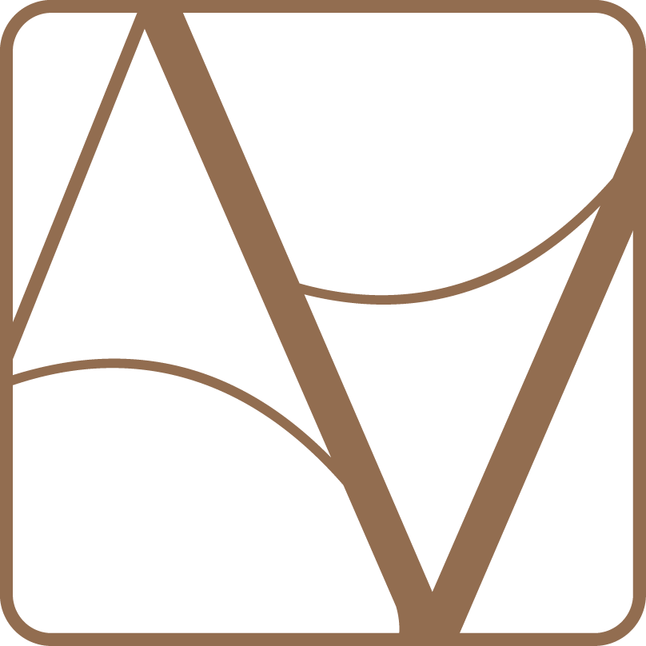 | **File**: `casa-amanzi-logo-dark.png`<br>**Dimensions**: 640×128 pixels (2x for retina)<br>**Aspect Ratio**: 5:1<br>**Format**: PNG<br>**Usage**: Navigation on light backgrounds<br>**Display Size**: 320×64px<br>**See on site**: [Services Page](https://v0-luxury-spa-branding.vercel.app/services) |

**Notes**: Provide both light and dark versions for different page backgrounds.

---

## Home Page Images

### Homepage Hero Banner (Animated)
**Location**: `images/home/`

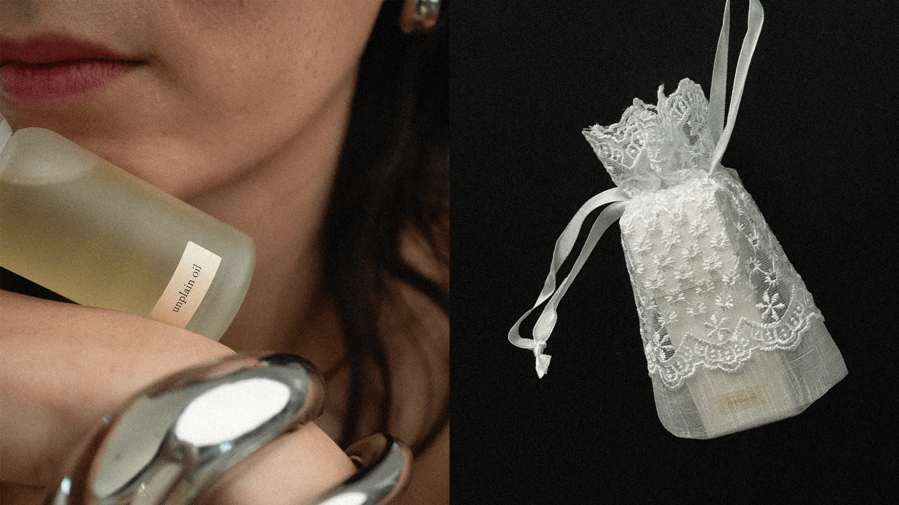

**File**: `hero-banner.gif`
**Dimensions**: 1920×1080 pixels
**Aspect Ratio**: 16:9
**Format**: GIF (animated)
**Usage**: Full-screen homepage hero section
**See on site**: [Homepage](https://v0-luxury-spa-branding.vercel.app/)
**Notes**: Optimize animation - limit to 3-5 seconds loop, max 2-3MB file size. Should work with 30% black overlay.

---

## About Page Images

### About Hero Background
**Location**: `images/about/`

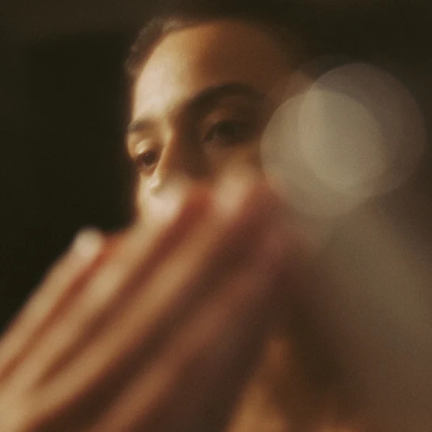

**File**: `hero-background.jpg`
**Dimensions**: 1920×1080 pixels
**Aspect Ratio**: 16:9
**Format**: JPG (quality: 85%)
**Usage**: About page hero section (responsive background)
**See on site**: [About Page](https://v0-luxury-spa-branding.vercel.app/about)
**Notes**: Compress to ~200-300KB for optimal performance

---

### Philosophy Section Image

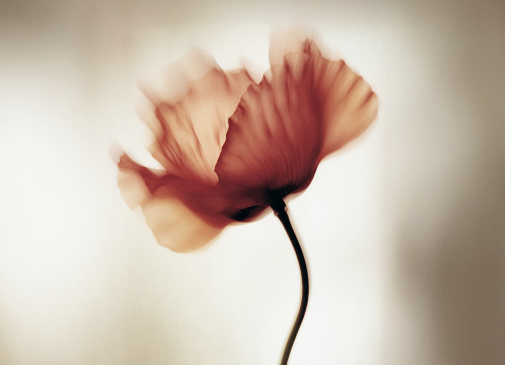

**File**: `philosophy-image.png`
**Dimensions**: 1600×1040 pixels
**Aspect Ratio**: 20:13
**Format**: PNG or JPG
**Usage**: "Our Philosophy" section on about page
**See on site**: [About Page - Philosophy Section](https://v0-luxury-spa-branding.vercel.app/about)
**Notes**: Max container width ~800px. Can use JPG for smaller file size if no transparency needed

---

### Landscape Background

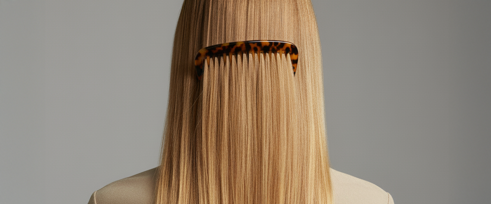

**File**: `landscape-background.png`
**Dimensions**: 1920×1080 pixels
**Aspect Ratio**: 16:9
**Format**: JPG or PNG
**Usage**: Background for journey section on about page
**See on site**: [About Page - Journey Section](https://v0-luxury-spa-branding.vercel.app/about)
**Notes**: Compress to ~200-300KB. Use JPG if no transparency needed

---

## Contact Page Images

### Decorative Element
**Location**: `images/contact/`

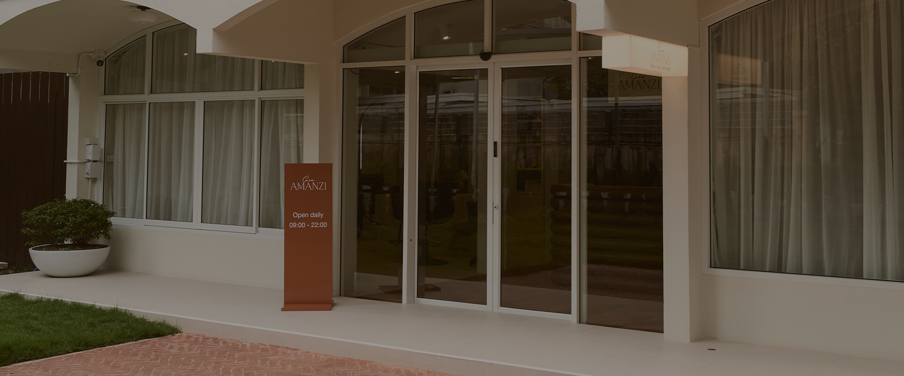

**File**: `decorative-element.png`
**Dimensions**: 800×800 pixels (2x for retina)
**Aspect Ratio**: 1:1 (square)
**Format**: PNG
**Usage**: Decorative element on contact/booking page
**Display Size**: 320-384px responsive
**See on site**: [Contact Page](https://v0-luxury-spa-branding.vercel.app/contact)
**Notes**: Displayed at 30% opacity. Keep file size under 100KB

---

## Service Category Images

**Location**: `images/services/`

All service images are displayed at 128px wide on desktop, full width on mobile.

| Preview | Details |
|---------|---------|
| 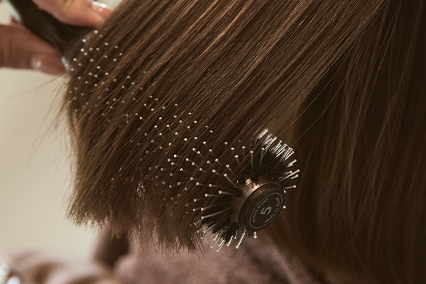 | **File**: `hair-services.png`<br>**Service**: Hair Styling<br>**Dimensions**: 384×256 pixels (2x for retina)<br>**Aspect Ratio**: 3:2<br>**Format**: PNG or JPG<br>**Display Size**: 128px wide on desktop<br>**See on site**: [Services Page](https://v0-luxury-spa-branding.vercel.app/services) |
| 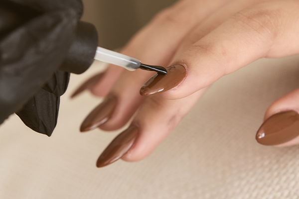 | **File**: `nail-services.png`<br>**Service**: Nail Care<br>**Dimensions**: 384×256 pixels (2x for retina)<br>**Aspect Ratio**: 3:2<br>**Format**: PNG or JPG<br>**Display Size**: 128px wide on desktop<br>**See on site**: [Services Page](https://v0-luxury-spa-branding.vercel.app/services) |
| 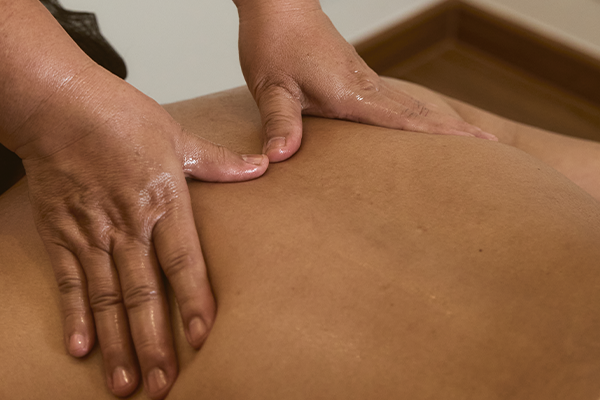 | **File**: `massage-services.png`<br>**Service**: Spa Treatment/Massage<br>**Dimensions**: 384×256 pixels (2x for retina)<br>**Aspect Ratio**: 3:2<br>**Format**: PNG or JPG<br>**Display Size**: 128px wide on desktop<br>**See on site**: [Services Page](https://v0-luxury-spa-branding.vercel.app/services) |
| 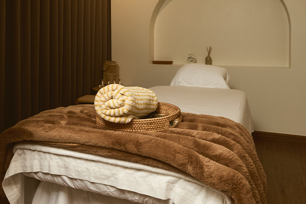 | **File**: `spa-services.png`<br>**Service**: Facial Care<br>**Dimensions**: 384×256 pixels (2x for retina)<br>**Aspect Ratio**: 3:2<br>**Format**: PNG or JPG<br>**Display Size**: 128px wide on desktop<br>**See on site**: [Services Page](https://v0-luxury-spa-branding.vercel.app/services) |
| 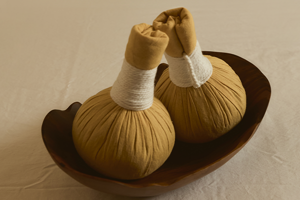 | **File**: `herbal-compress-services.png`<br>**Service**: Body Treatment<br>**Dimensions**: 384×256 pixels (2x for retina)<br>**Aspect Ratio**: 3:2<br>**Format**: PNG or JPG<br>**Display Size**: 128px wide on desktop<br>**See on site**: [Services Page](https://v0-luxury-spa-branding.vercel.app/services) |
| 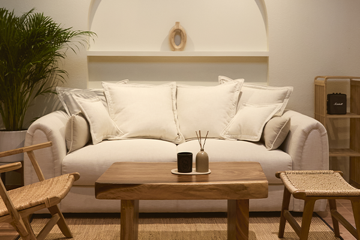 | **File**: `wellness-services.png`<br>**Service**: Wellness<br>**Dimensions**: 384×256 pixels (2x for retina)<br>**Aspect Ratio**: 3:2<br>**Format**: PNG or JPG<br>**Display Size**: 128px wide on desktop<br>**See on site**: [Services Page](https://v0-luxury-spa-branding.vercel.app/services) |

**Notes**: Each image should be under 50KB. Use JPG for photos, PNG for graphics.

---

## Membership Card Images

**Location**: `images/membership/`

### Membership Hero Background

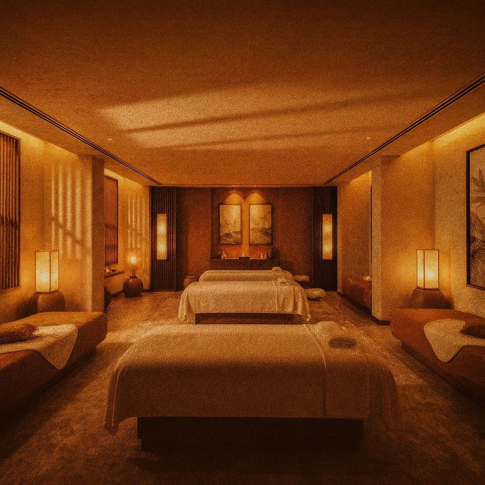

**File**: `hero-background.png`
**Dimensions**: 1920×1080 pixels
**Aspect Ratio**: 16:9
**Format**: JPG or PNG
**Usage**: Full-frame background on membership hero section
**See on site**: [Membership Page](https://v0-luxury-spa-branding.vercel.app/membership)
**Notes**: Displayed at 30% opacity over black background. Compress to ~200-300KB. Use JPG if no transparency needed

---

### Membership Tier Cards

All cards should resemble credit card proportions with 3:2 aspect ratio.

| Card Preview | Tier Details |
|--------------|--------------|
| 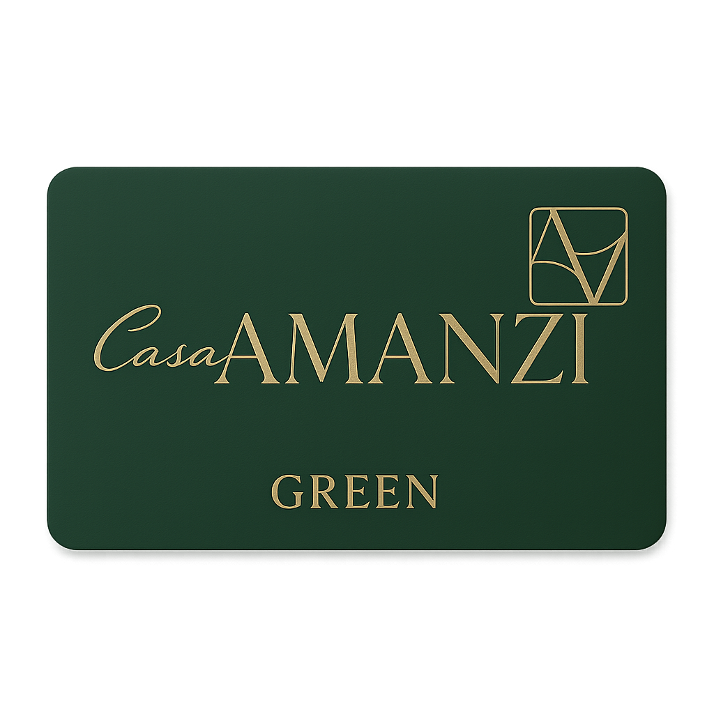 | **File**: `green-card.png`<br>**Tier**: Green (฿30,000)<br>**Dimensions**: 800×534 pixels (2x for retina)<br>**Aspect Ratio**: 3:2<br>**Max container**: ~320px wide<br>**See on site**: [Membership Page](https://v0-luxury-spa-branding.vercel.app/membership) |
| 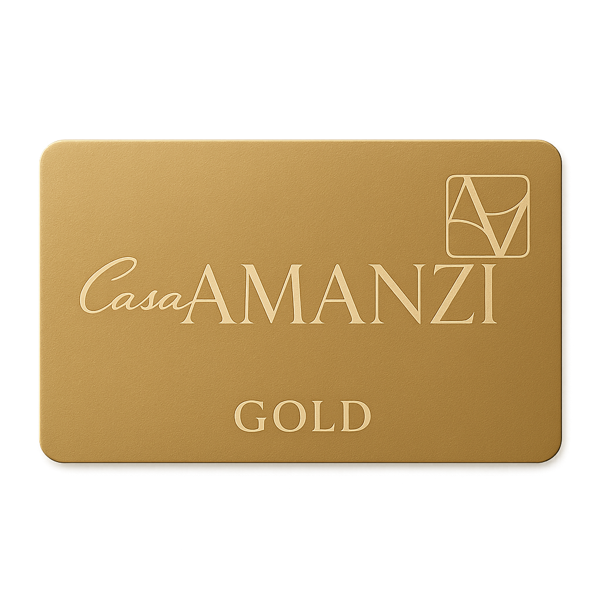 | **File**: `gold-card.png`<br>**Tier**: Gold (฿50,000)<br>**Dimensions**: 800×534 pixels (2x for retina)<br>**Aspect Ratio**: 3:2<br>**Max container**: ~320px wide<br>**See on site**: [Membership Page](https://v0-luxury-spa-branding.vercel.app/membership) |
| 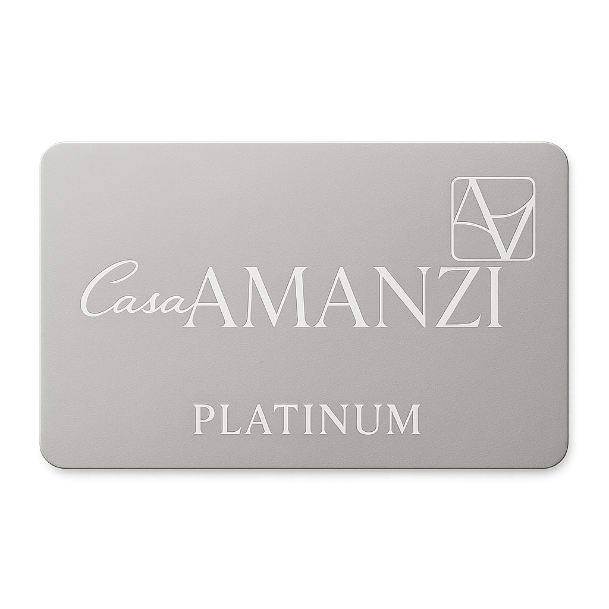 | **File**: `platinum-card.png`<br>**Tier**: Platinum (฿100,000)<br>**Dimensions**: 800×534 pixels (2x for retina)<br>**Aspect Ratio**: 3:2<br>**Max container**: ~320px wide<br>**See on site**: [Membership Page](https://v0-luxury-spa-branding.vercel.app/membership) |
| 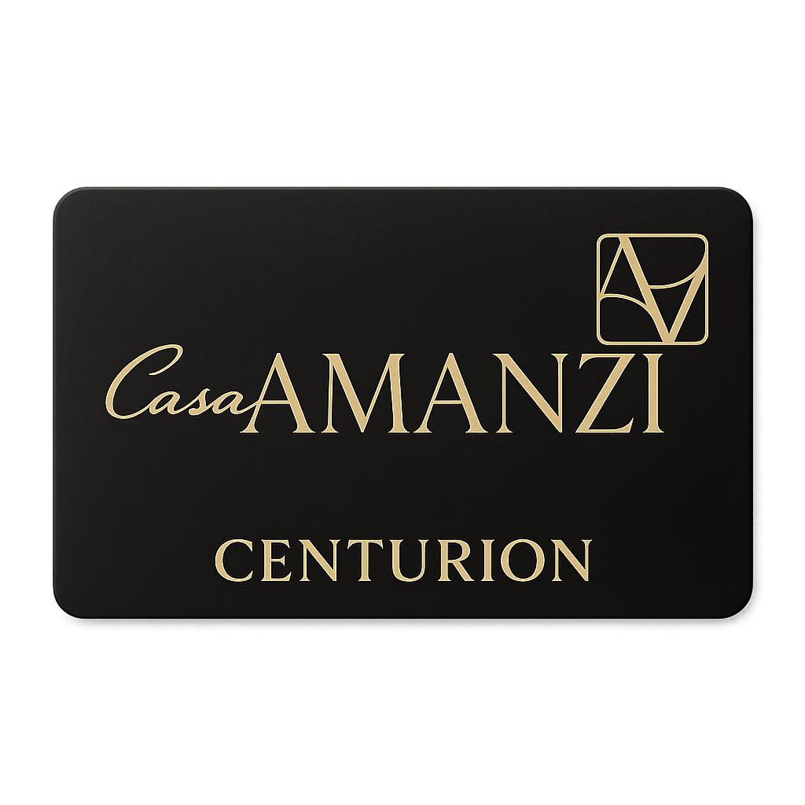 | **File**: `centurion-card.png`<br>**Tier**: Centurion (฿300,000)<br>**Dimensions**: 800×534 pixels (2x for retina)<br>**Aspect Ratio**: 3:2<br>**Max container**: ~320px wide<br>**See on site**: [Membership Page](https://v0-luxury-spa-branding.vercel.app/membership) |
| 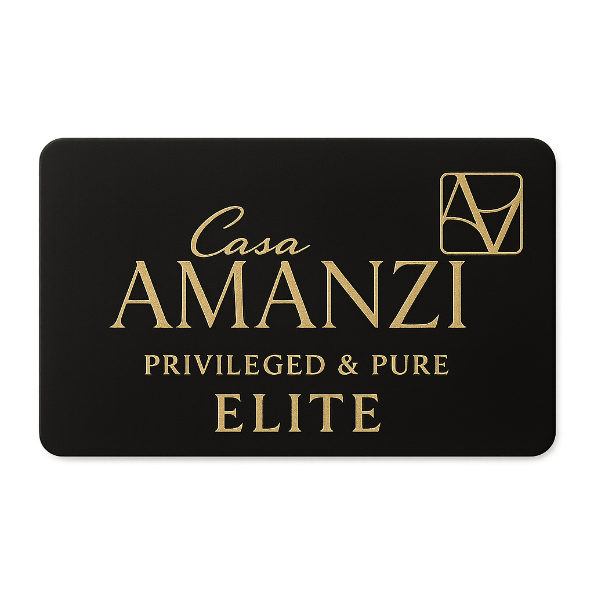 | **File**: `elite-card.png`<br>**Tier**: Elite (฿500,000)<br>**Dimensions**: 800×534 pixels (2x for retina)<br>**Aspect Ratio**: 3:2<br>**Max container**: ~320px wide<br>**See on site**: [Membership Page](https://v0-luxury-spa-branding.vercel.app/membership) |

**Notes**: Cards have hover scale effect on website. Keep each card under 150KB for optimal loading.

---

## Promotions Images

**Location**: `images/promotions/`

### Promotions Hero Background

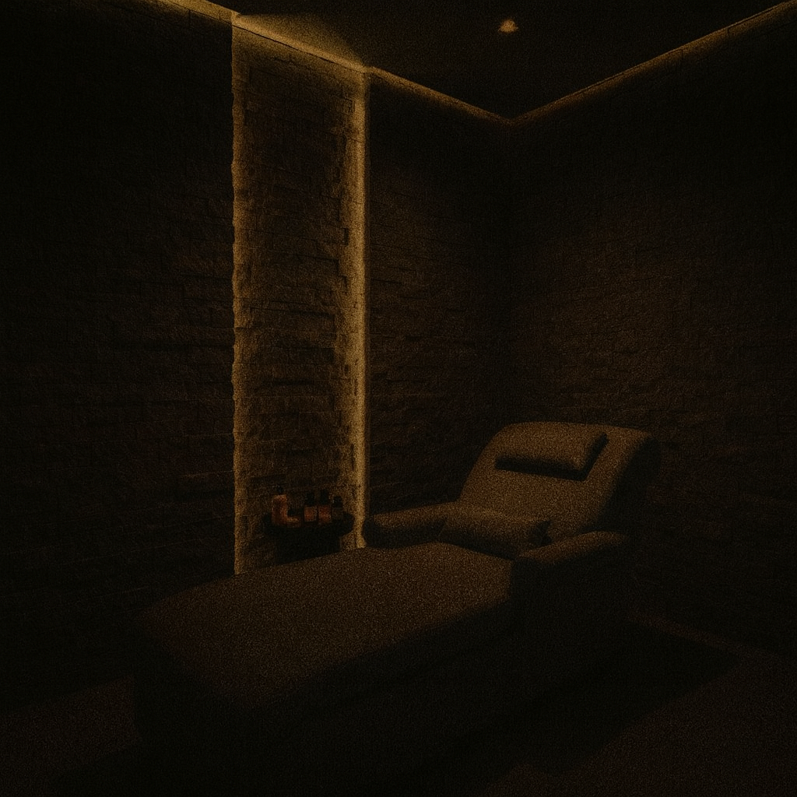

**File**: `hero-background.png`
**Dimensions**: 900×900 pixels (2x for retina)
**Aspect Ratio**: 1:1 (square)
**Format**: PNG or JPG
**Display Size**: 300-450px responsive
**Usage**: Centered background on promotions page
**See on site**: [Promotions Page](https://v0-luxury-spa-branding.vercel.app/promotions)
**Notes**: Displayed at 20% opacity. Keep under 150KB

---

## File Structure

```
designer-package/
├── IMAGE_SPECIFICATIONS.md (this file)
└── images/
    ├── home/
    │   └── hero-banner.gif
    ├── about/
    │   ├── hero-background.jpg
    │   ├── philosophy-image.png
    │   └── landscape-background.png
    ├── contact/
    │   └── decorative-element.png
    ├── services/
    │   ├── hair-services.png
    │   ├── nail-services.png
    │   ├── massage-services.png
    │   ├── spa-services.png
    │   ├── herbal-compress-services.png
    │   └── wellness-services.png
    ├── membership/
    │   ├── hero-background.png
    │   ├── green-card.png
    │   ├── gold-card.png
    │   ├── platinum-card.png
    │   ├── centurion-card.png
    │   └── elite-card.png
    ├── promotions/
    │   └── hero-background.png
    └── shared/
        └── logos/
            ├── casa-amanzi-logo-light.png
            └── casa-amanzi-logo-dark.png
```

---

## Design Guidelines

### Image Quality & Optimization
- **Balance quality with file size** - target 85% quality for JPG
- **Compress for web** - keep file sizes as small as possible while maintaining visual quality
- Use appropriate format:
  - **GIF**: For animations only (optimize animation, limit frames)
  - **JPG**: For photos/backgrounds without transparency (85% quality)
  - **PNG**: For graphics, logos, items requiring transparency (use PNG-8 when possible)
- **Target file sizes**:
  - Hero images: 200-300KB max
  - Card/blog images: 100-150KB max
  - Small thumbnails/icons: 30-50KB max
  - Logos: 20-30KB max

### Color Palette (Optional can change as you wish)
- Primary: **#8B7355** (warm brown/tan)
- Supporting: Warm neutrals, whites, soft golds
- Ensure images complement the brand color

### Style Requirements (Optional can change as you wish)
- **Aesthetic**: Western-inspired glamour, luxury spa
- **Mood**: Elegant, sophisticated, calming
- **Lighting**: Warm, natural lighting preferred
- **Composition**: Clean, uncluttered, professional

### Image Effects to Consider
- Some images displayed with overlays (20-30% black)
- Some images displayed at reduced opacity (20-30%)
- All images should work well with text overlays

### Retina Display Optimization
- Most images are specified at **2x resolution** (double the display size)
- Example: Display size 320px → Image size 640px
- This ensures crisp rendering on high-DPI screens (Retina, 4K displays)
- Balance retina quality with file size - aggressive compression is acceptable since images display smaller

---

## Delivery Instructions

### When Sending Updated Files:

1. **Maintain exact file names** - Do not change any file names
2. **Keep folder structure** - Maintain the same folder organization
3. **Match dimensions** - Use the exact dimensions specified (2x for retina displays)
4. **Match aspect ratios** - Always maintain the correct aspect ratio
5. **Use correct formats** - Follow format requirements (GIF/JPG/PNG as specified)
6. **Optimize for web performance** - Compress images to target file sizes
7. **Test file sizes** - Verify each image meets the maximum file size targets

### Preferred Delivery Method:
- Zip the entire `images/` folder
- Include this specifications file if you have notes
- Maintain the folder structure as shown above

---

## Quality Checklist

Before sending, please verify:

- ✓ All file names match exactly (including case sensitivity)
- ✓ Dimensions match specifications exactly (2x size for retina displays)
- ✓ Aspect ratios are correct for each image
- ✓ File formats are correct (GIF/JPG/PNG as specified)
- ✓ Images are compressed to target file sizes (check KB limits)
- ✓ JPG quality set to ~85% for optimal compression
- ✓ PNG files use appropriate bit depth (PNG-8 vs PNG-24)
- ✓ Images complement brand color #8B7355
- ✓ Images fit luxury spa aesthetic (elegant, sophisticated, calming)
- ✓ Folder structure is maintained
- ✓ All images work well with overlays/opacity as noted